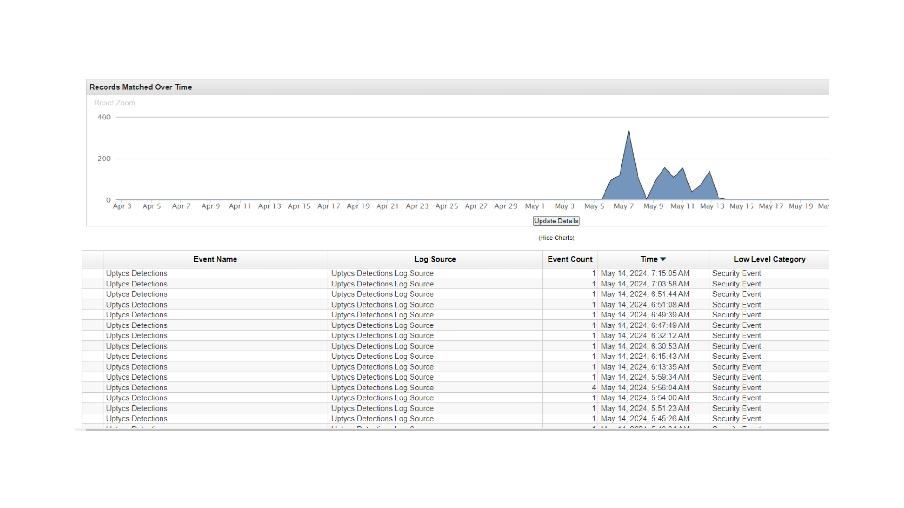

# QRADAR-SIEM

### Uptycs Events in QRADAR SIEM

### Link

Extension: [Threat Analysis with Uptycs](https://exchange.xforce.ibmcloud.com/hub/extension/66ca095b46d153de14f6052e1ce7eaad "Threat Analysis with Uptycs")

Documentation: [Integrating Uptycs Cloud to QRADAR SIEM](https://exchange.xforce.ibmcloud.com/api/hub/extensionsNew/56c4b883af199fe3659c4bb9fc7d18aa/Integrating-QRADAR-SIEM-with-Uptycs.pdf "Integrating Uptycs cloud to QRADAR SIEM")
